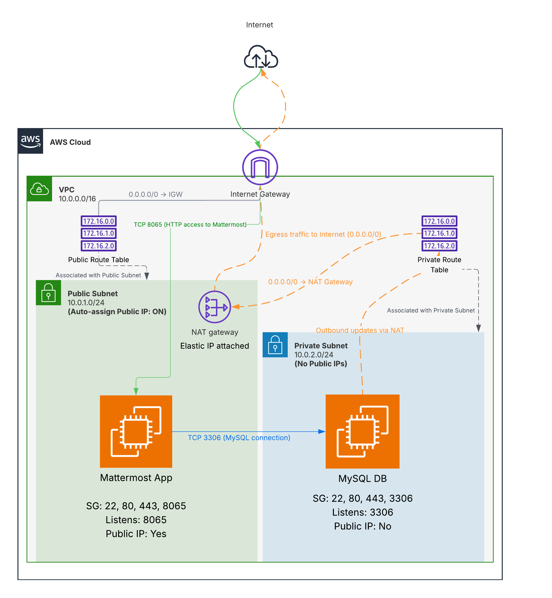

# Mattermost on AWS — Two-Tier VPC Deployment (Public App + Private MySQL)
**Author:** Nasim Bayati  
**Date:** October 2025  
**Program:** Post Graduate Program in Cloud Computing (UT Austin)

---

## 🌐 Project Overview

This project implements a **secure two-tier architecture** on AWS:
- **Application Layer:** Mattermost deployed on an EC2 instance in a **public subnet**.
- **Database Layer:** MySQL 5.7 installed on a separate EC2 instance in a **private subnet**.
- The public and private layers are connected within a **custom VPC** using an Internet Gateway, NAT Gateway, and route tables.

The project demonstrates key AWS skills:
- VPC networking and subnet isolation  
- Security group configuration  
- SSH tunneling and key permissions  
- Application and database setup  
- Cloud infrastructure testing and verification

---

## 🏗️ Architecture Diagram

Below is the architecture of the two-tier Mattermost deployment on AWS.  
It illustrates how public and private subnets, routing components, and EC2 instances communicate securely within the VPC.

<p align="center">
  
</p>

> **Figure:** Mattermost (Application Layer) is deployed in the **Public Subnet**, while MySQL (Database Layer) is hosted in the **Private Subnet**.  
> The **Internet Gateway (IGW)** provides public access for the application, and the **NAT Gateway** enables the private database instance to download updates securely without a public IP.

### 🔹 Key Components

| Layer | Component | Description |
|-------|------------|-------------|
| **Internet Edge** | Internet Gateway (IGW) | Allows public inbound/outbound traffic for resources in the public subnet. |
| **VPC** | 10.0.0.0/16 | Isolated virtual network containing all subnets and resources. |
| **Public Subnet** | 10.0.1.0/24 | Hosts the **Mattermost Application Server (EC2)** and the **NAT Gateway** with an Elastic IP. |
| **Private Subnet** | 10.0.2.0/24 | Hosts the **MySQL Database Server (EC2)**, with no public IP. |
| **Public Route Table** | Route: `0.0.0.0/0 → IGW` | Sends Internet-bound traffic through the Internet Gateway. |
| **Private Route Table** | Route: `0.0.0.0/0 → NAT Gateway` | Sends Internet-bound traffic from private subnet through NAT. |
| **Security Groups** | App-SG / DB-SG | Controls inbound/outbound ports for EC2 instances (App: 22,80,443,8065 / DB: 22,80,443,3306). |

### 🔹 Network Traffic Flow

1. **Client (Internet)** → **IGW** → **App Server (Public Subnet)** on port **8065**  
2. **App Server** → **DB Server (Private Subnet)** on port **3306**  
3. **DB Server** → **NAT Gateway** → **IGW** for outbound updates (no direct public access)

---

### 🧭 Download the Vector Version
If you’d like to zoom in or reuse the diagram, download the SVG version:

[📄 Download Architecture Diagram (SVG)](docs/diagrams/aws-mattermost-architecture.svg)


---

## 📸 Screenshot Evidence

| Step | Description | Screenshot File |
|------|--------------|----------------|
| 1 | VPC created | `docs/screenshots/01-vpc-created.png` |
| 2 | Public subnet created | `docs/screenshots/02-public-subnet-created.png` |
| 3 | Public subnet auto-assign | `docs/screenshots/03-public-subnet-autoassign.png` |
| 4 | Private subnet created | `docs/screenshots/04-private-subnet-created.png` |
| 5 | No public IP on private subnet | `docs/screenshots/05-private-subnet-no-public-ip.png` |
| 6 | Internet Gateway attached | `docs/screenshots/06-internet-gateway-attached.png` |
| 7 | Public route table created & associated | `docs/screenshots/07-public-route-table.png`, `docs/screenshots/07-public-route-table-subnets.png` |
| 8 | NAT Gateway created | `docs/screenshots/08-nat-gateway-created.png` |
| 9 | Private route table created | `docs/screenshots/09-private-route-table.png` |
| 10 | Application SG rules | `docs/screenshots/10-app-sg-rules.png` |
| 11 | Database SG rules | `docs/screenshots/11-db-sg-rules.png` |
| 12 | EC2 App configuration | `docs/screenshots/12-ec2-app-instance-configuration.png`, `docs/screenshots/12-ec2-app-instance-configuration-cont.png` |
| 13 | App instance after creation | `docs/screenshots/13-instance-app-after-creation.png` |
| 14 | EC2 DB configuration | `docs/screenshots/14-ec2-db-instance-configuration.png`, `docs/screenshots/14-ec2-db-instance-configuration-cont.png` |
| 15 | DB instance after creation | `docs/screenshots/15-Instance-DB-after-creation.png` |
| 16 | SSH into App | `docs/screenshots/16-ssh-into-app.png` |
| 17 | SSH into DB | `docs/screenshots/17-ssh-into-db.png` |
| 18 | MySQL installation (multi-part) | `docs/screenshots/18-mysql-installation-part1.png` → `docs/screenshots/18-mysql-installation-part4.png` |
| 19 | MySQL active/running | `docs/screenshots/19-mysql-running-active.png` |
| 20 | Temporary password retrieved | `docs/screenshots/20-temp-password.png` |
| 21 | MySQL script executed | `docs/screenshots/21-run-mysql-script.png` |
| 22 | Mattermost script downloaded | `docs/screenshots/22-mattermost-script-downloaded.png` |
| 23 | Mattermost script executed | `docs/screenshots/23-mattermost-script-executing.png` |
| 24 | Mattermost server started | `docs/screenshots/24-mattermost-server-start.png` |
| 25 | Mattermost web accessed | `docs/screenshots/25-mattermost-web-access.png` |

---

## ⚙️ Implementation Steps

### **Step 1: Create Custom VPC**

**Purpose:** Provide a secure, isolated network for the project.

```bash
VPC CIDR: 10.0.0.0/16
Public Subnet: 10.0.1.0/24
Private Subnet: 10.0.2.0/24
```

✅ **Enable DNS hostnames** — Required for EC2 public DNS resolution.  
📸 *Screenshot:* `docs/screenshots/01-vpc-created.png`

---

### **Step 2: Internet & Routing Configuration**

- **Attach Internet Gateway** (for outbound internet on public subnet)  
- **Create NAT Gateway** (for outbound access from private subnet)  
- **Set Route Tables**
  - Public RT → `0.0.0.0/0 → IGW`
  - Private RT → `0.0.0.0/0 → NATGW`

**Why:** Ensures public subnet can host web apps, while private subnet can reach the internet securely via NAT.  

📸 *Screenshots:* `docs/screenshots/06-internet-gateway-attached.png`, `docs/screenshots/08-nat-gateway-created.png`, `docs/screenshots/09-private-route-table.png`

---

### **Step 3: Security Groups**

- **App-SG:** Ports 22, 80, 443, 8065 open (lab environment).  
- **DB-SG:** Ports 22, 80, 443, 3306 open (lab environment).  

**Why:** These rules allow controlled communication between tiers and user access.  
📸 *Screenshots:* `docs/screenshots/10-app-sg-rules.png`, `docs/screenshots/11-db-sg-rules.png`

---

### **Step 4: Launch EC2 Instances**

#### **Application Server**
- Amazon Linux 2 (t3.micro)
- Subnet: Public
- SG: App-SG

#### **Database Server**
- Amazon Linux 2 (t3.micro)
- Subnet: Private
- SG: DB-SG

📸 *Screenshots:* `docs/screenshots/12-ec2-app-instance-configuration.png`, `docs/screenshots/12-ec2-app-instance-configuration-cont.png`, `docs/screenshots/13-instance-app-after-creation.png`, `docs/screenshots/14-ec2-db-instance-configuration.png`, `docs/screenshots/14-ec2-db-instance-configuration-cont.png`, `docs/screenshots/15-Instance-DB-after-creation.png`

---

### **Step 5: Configure SSH Key Permissions (Windows PowerShell)**

```powershell
$KEY = "E:\UT\Projects\Project1\Project-key.pem"
icacls $KEY /inheritance:r
$ME = "$env:USERDOMAIN\$env:USERNAME"
icacls $KEY /grant:r "${ME}:(R)"
icacls $KEY /grant:r "SYSTEM:(R)"
icacls $KEY /remove "Authenticated Users" "BUILTIN\Administrators" "Users" "Everyone"
icacls $KEY
```

**Why:** Restricts key permissions; SSH refuses insecure keys.  
📸 *Screenshot:* `docs/screenshots/16-ssh-into-app.png`

---

### **Step 6: SSH Connections**

```powershell
ssh -i "E:\UT\Projects\Project1\Project-key.pem" ec2-user@<APP_PUBLIC_IP>
# (Optional if you kept a single key, copy key to App to hop to DB)
scp -i "E:\UT\Projects\Project1\Project-key.pem" "E:\UT\Projects\Project1\Project-key.pem" ec2-user@<APP_PUBLIC_IP>:/home/ec2-user/Project-key.pem
```

On the **Application Server**:
```bash
chmod 400 ~/Project-key.pem
ssh -i ~/Project-key.pem ec2-user@<DB_PRIVATE_IP>
```

**Why:** Use the App server as a **bastion host** to reach the private DB instance.  
📸 *Screenshots:* `docs/screenshots/16-ssh-into-app.png`, `docs/screenshots/17-ssh-into-db.png`

---

### **Step 7: Install MySQL (Database Server)**

```bash
sudo yum update -y
wget http://dev.mysql.com/get/mysql57-community-release-el7-9.noarch.rpm
sudo yum localinstall mysql57-community-release-el7-9.noarch.rpm -y
sudo yum install mysql-community-server -y --nogpgcheck
sudo systemctl start mysqld.service
sudo systemctl status mysqld -l --no-pager
```

**Retrieve Temporary Password:**
```bash
TEMP_PWD=$(sudo grep 'temporary password' /var/log/mysqld.log | awk '{printf "%s", $11}')
echo $TEMP_PWD
```

**Login and Set Required Password:**
```bash
mysql -u root --password=$TEMP_PWD
```
At the `mysql>` prompt:
```sql
ALTER USER 'root'@'localhost' IDENTIFIED BY 'Password42!';
exit;
```

**Finalize Setup:**
```bash
wget https://d6opu47qoi4ee.cloudfront.net/install_mysql_linux.sh
chmod 777 install_mysql_linux.sh
sudo ./install_mysql_linux.sh
```

**Why:** Installs and initializes MySQL for Mattermost to connect.  
📸 *Screenshots:* `docs/screenshots/18-mysql-installation-part1.png` → `docs/screenshots/21-run-mysql-script.png` (incl. `docs/screenshots/19-mysql-running-active.png`, `docs/screenshots/20-temp-password.png`)

---

### **Step 8: Install Mattermost (Application Server)**

```bash
wget https://d6opu47qoi4ee.cloudfront.net/install_mattermost_linux.sh
sudo yum install dos2unix -y
sudo dos2unix install_mattermost_linux.sh
chmod 700 install_mattermost_linux.sh
sudo ./install_mattermost_linux.sh <DB_PRIVATE_IP>

sudo chown -R mattermost:mattermost /opt/mattermost
sudo chmod -R g+w /opt/mattermost
cd /opt/mattermost
sudo -u mattermost ./bin/mattermost
```

**Why:** Downloads, configures, and launches the Mattermost collaboration server.  
📸 *Screenshots:* `docs/screenshots/22-mattermost-script-downloaded.png`, `docs/screenshots/23-mattermost-script-executing.png`, `docs/screenshots/24-mattermost-server-start.png`, `docs/screenshots/25-mattermost-web-access.png`

---

## 🔍 Verification

Access Mattermost via:

```
http://<APP_PUBLIC_IP>:8065
```

If the server displays the Mattermost login page, the deployment is successful.

---

## 🔒 Security Hardening Recommendations

| Area | Best Practice |
|------|----------------|
| SSH | Use AWS SSM Session Manager instead of SSH in production |
| DB Access | Limit port 3306 to the App-SG only |
| IAM | Use roles for EC2 to access S3 or SSM securely |
| HTTPS | Use ALB + ACM certificate to serve Mattermost over TLS |
| Logs | Stream `/opt/mattermost/logs` to CloudWatch for analysis |

---

## 📈 Elasticity & Scalability

To achieve elasticity for Mattermost:
- Launch multiple app servers in an **Auto Scaling Group (ASG)**.
- Place them behind an **Application Load Balancer (ALB)**.
- Store shared data on **S3/EFS**, database on **RDS MySQL**.
- Use **target-tracking scaling policies** based on CPU or request count.

---

## 🚀 How to Use This Repository

1. **Clone this repo:**
   ```bash
   git clone https://github.com/<your-username>/project1-mattermost-aws.git
   cd project1-mattermost-aws
   ```


2. **Explore the documentation:**

   - `README.md` — Full project walkthrough
   - `docs/diagrams/` — Architecture visuals
   - `docs/screenshots/` — Step-by-step evidence

3. **View the architecture:**

   - PNG inline in README: `docs/diagrams/aws-mattermost-architecture.png`
   - Optional SVG for zooming: `docs/diagrams/aws-mattermost-architecture.svg`

---

## 🧹 Resource Cleanup

When finished, delete in reverse order:
1. Terminate EC2 instances  
2. Delete NAT Gateway (to stop hourly billing)  
3. Delete Route Tables, Subnets, VPC  
4. Release Elastic IP

---

## 🗂️ Repository Structure

```
project1-mattermost-aws/
├── README.md
├── docs/
│   ├── diagrams/
│   │   ├── aws-mattermost-architecture.png
│   │   └── aws-mattermost-architecture.svg
│   └── screenshots/
│       ├── 01-vpc-created.png
│       ├── ...
│       └── 25-mattermost-web-access.png
├── .gitignore
└── LICENSE

```

**.gitignore**
```
*.pem
*.ppk
.DS_Store
Thumbs.db
```

---

## ✅ Key Learnings

- Built a secure two-tier architecture with private and public subnets.  
- Configured MySQL on a private host accessible only from the app layer.  
- Managed IAM, routing, and security group dependencies.  
- Practiced SSH tunneling via bastion, permissions via `icacls`.  
- Learned automation via custom shell scripts for installation.

---

## 👩‍💻 Author

**Nasim Bayati**  
Bachelor of Applied Science in Software Development (ACC)  
Post Graduate Program in Cloud Computing: Leveraging AI (UT Austin)  
AWS Cloud Practitioner and Solutions Architect in progress ☁️

---

## 📜 License
This project is licensed under the [MIT License](LICENSE).  
© 2025 Nasim Bayati — for educational and non-commercial use.

